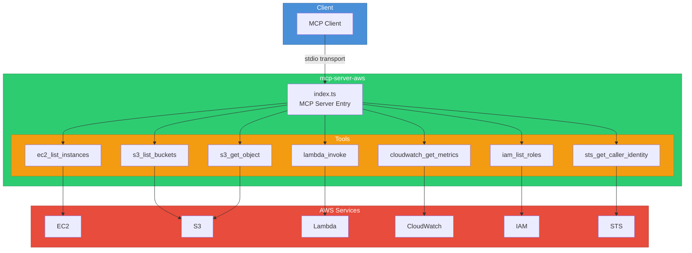

# mcp-server-aws

An MCP (Model Context Protocol) server that provides tools for interacting with AWS services including EC2, S3, Lambda, CloudWatch, IAM, and STS.

## Architecture



## Installation

```bash
npm install
npm run build
```

## Configuration

Set the following environment variables or configure AWS credentials via `~/.aws/credentials`:

| Variable | Description | Required |
|---|---|---|
| `AWS_ACCESS_KEY_ID` | AWS access key ID | Yes (if not using profile) |
| `AWS_SECRET_ACCESS_KEY` | AWS secret access key | Yes (if not using profile) |
| `AWS_REGION` | AWS region (default: `us-east-1`) | No |
| `AWS_PROFILE` | AWS profile name | No |

## Usage

### Standalone

```bash
npm start
```

### Development

```bash
npm run dev
```

### Docker

```bash
docker build -t mcp-server-aws .
docker run -e AWS_ACCESS_KEY_ID=xxx -e AWS_SECRET_ACCESS_KEY=xxx mcp-server-aws
```

### MCP Client Configuration

```json
{
  "mcpServers": {
    "aws": {
      "command": "node",
      "args": ["dist/index.js"],
      "env": {
        "AWS_REGION": "us-east-1"
      }
    }
  }
}
```

## Tool Reference

| Tool | Description | Parameters |
|---|---|---|
| `ec2_list_instances` | List EC2 instances | `region?`, `filters?` |
| `s3_list_buckets` | List S3 buckets | none |
| `s3_get_object` | Get object from S3 | `bucket`, `key` |
| `lambda_invoke` | Invoke Lambda function | `function_name`, `payload?` |
| `cloudwatch_get_metrics` | Get CloudWatch metrics | `namespace`, `metric_name`, `dimensions?`, `period?`, `start_time`, `end_time` |
| `iam_list_roles` | List IAM roles | `path_prefix?`, `max_items?` |
| `sts_get_caller_identity` | Get caller identity | none |

## License

MIT
